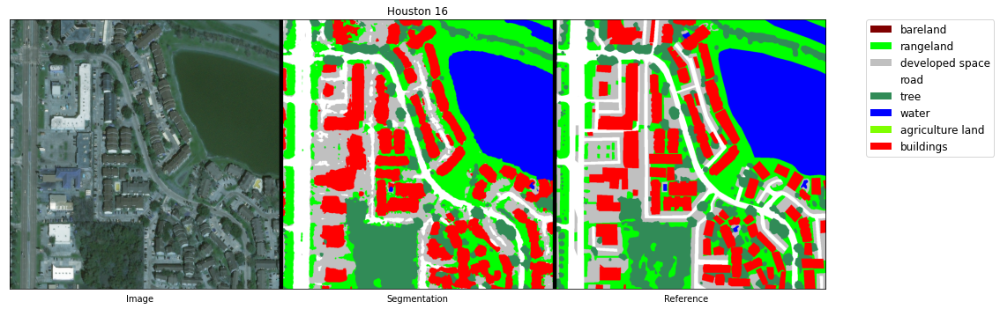
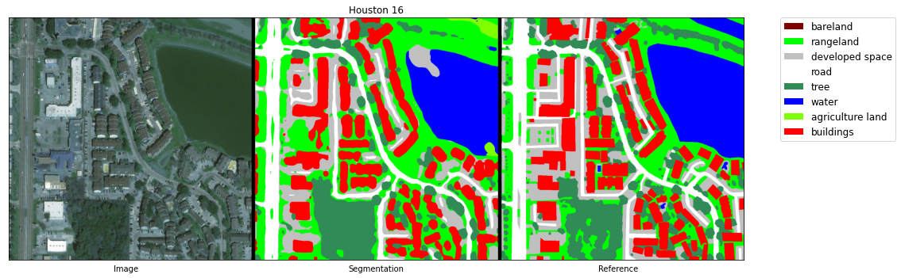
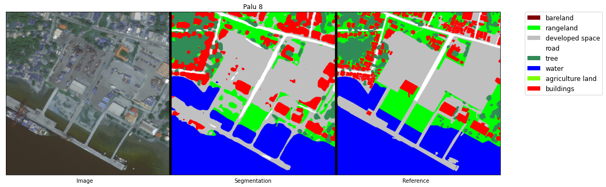

<div align="center">
<p></p>
<p>
    <a href="https://github.com/cliffbb/OEM-Lightweight/blob/main/LICENSE">.svg?style=for-the-badge"></a>
    <a href="https://pytorch.org/get-started/previous-versions/"></a>
    <a href="https://www.python.org/downloads/"></a>
</p>
</div>

# Lightweight Mapping Model
### Overview
___
This is a demo of OpenEarthMap lightweight models searched with
[SparseMask](https://arxiv.org/abs/1904.07642) and
[FasterSeg](https://arxiv.org/abs/1912.10917) neural architecture search methods. 
The models were automatically searched and pretrained on the OpenEarthMap 
[dataset](https://zenodo.org/record/7223446#.Y2Jj1OzP2Ak) 
(using only the training and validation sets).

### OpenEarthMap dataset
___
OpenEarthMap is a benchmark dataset for global high-resolution land cover mapping. 
OpenEarthMap consists of 5000 aerial and satellite images with manually annotated 
8-class land cover labels and 2.2 million segments at a 0.25-0.5m ground 
sampling distance, covering 97 regions from 44 countries across 6 continents. 
OpenEarthMap fosters research including but not limited to semantic segmentation
and domain adaptation. Land cover mapping models trained on OpenEarthMap generalize 
worldwide and can be used as off-the-shelf models in a variety of applications. 
Project Page: https://open-earth-map.org/
```
@inproceedings{xia_2023_openearthmap,
    title = {OpenEarthMap: A Benchmark Dataset for Global High-Resolution Land Cover Mapping},
    author = {Junshi Xia and Naoto Yokoya and Bruno Adriano and Clifford Broni-Bediako},
    booktitle = {Proceedings of the IEEE/CVF Winter Conference on Applications of Computer Vision (WACV)},
    month = {January},
    year = {2023}
}
```

### Lightweight model
___
The lightweight models searched and pretrained on the OpenEarthMap dataset 
can be downloaded as following:

| Method    | Searched architecture   | Pretrained weights           | #Params |  FLOP   |
|:----------|:------------------------|:-----------------------------|:-------:|:-------:|
| SpareMask | [mask_thres_0.001.npy](https://drive.google.com/file/d/1WwE2pIHTb7xGql7xQ9TxeZ1pZmk2JhCl/view?usp=sharing)| [checkpoint_63750.pth.tar](https://drive.google.com/file/d/170o8NNBrrIBJqFdoeYCJoyKHvuub0v2k/view?usp=sharing) | 2.96MB  | 10.45GB |
| FasterSeg | [arch_1.pt](https://drive.google.com/file/d/12oDzi-sDnD_Y4CBONei_g2SZBMZ6cx-2/view?usp=sharing)           | [weights1.pt](https://drive.google.com/file/d/1BgCu1Rz2PvTPJzI_J97hNkr4HvlvI-pE/view?usp=sharing)              | 3.47MB  | 15.43GB |

### Usage
___
* **SparseMask model:** download the [architecture mask](https://drive.google.com/file/d/1WwE2pIHTb7xGql7xQ9TxeZ1pZmk2JhCl/view?usp=sharing) and the [pretrained weights](https://drive.google.com/file/d/170o8NNBrrIBJqFdoeYCJoyKHvuub0v2k/view?usp=sharing)
and put them into folder `models/SparseMask/`.   
Start the evaluation demo as:
```
python eval_oem_lightweight.py \
    --model "sparsemask" \
    --arch "models/SparseMask/mask_thres_0.001.npy" \
    --pretrained_weights "models/SparseMask/checkpoint_63750.pth.tar" \
    --save_image --save_dir "results" 
```   
&nbsp;&nbsp;&nbsp;&nbsp;&nbsp;&nbsp;
Or use the Jupyter notebook: `sparsemask_demo.ipynb`.

* **FasterSeg model:** download the [architecture structure](https://drive.google.com/file/d/12oDzi-sDnD_Y4CBONei_g2SZBMZ6cx-2/view?usp=sharing) and the [pretrained weights](https://drive.google.com/file/d/1BgCu1Rz2PvTPJzI_J97hNkr4HvlvI-pE/view?usp=sharing)
and put them into folder `models/FasterSeg/`.   
Start the evaluation demo as:
```
python eval_oem_lightweight.py \
    --model "fasterseg" \
    --arch "models/FasterSeg/arch_1.pt" \
    --pretrained_weights "models/FasterSeg/weights1.pt" \
    --save_image --save_dir "results" 
```
&nbsp;&nbsp;&nbsp;&nbsp;&nbsp;&nbsp;
Or use the Jupyter notebook `fasterseg_demo.ipynb`.

### Example of predictions
___
* **SparseMask model**   
    

* **FasterSeg model**    
    


### Acknowledgement
___
Automated neural architecture search method code from
* [SparseMask](https://github.com/wuhuikai/SparseMask)
* [FasterSeg](https://github.com/VITA-Group/FasterSeg)